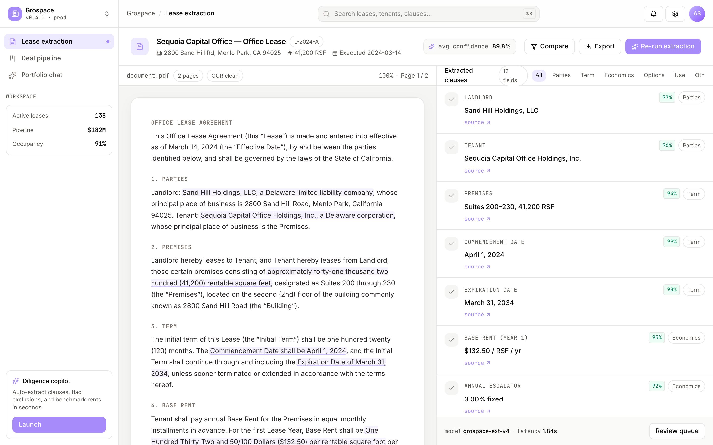
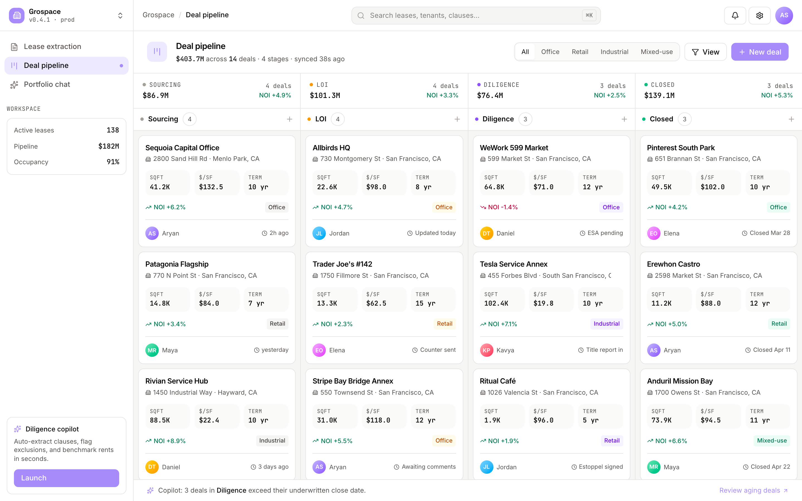
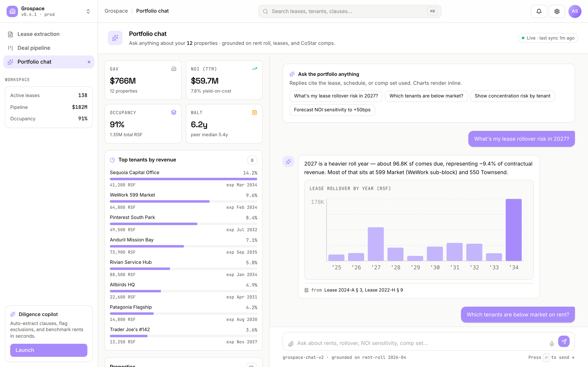

# Grospace

**AI lease management for commercial real estate.**

Extract clauses from leases, run a deal pipeline, and chat with your portfolio — in one workspace.


## Run locally

```bash
npm install
npm run dev
# open http://localhost:3002
```

Production build:

```bash
npm run build
npm start
```

## Routes

| Path         | Description                                                                   |
| ------------ | ----------------------------------------------------------------------------- |
| `/`          | Lease extraction — split-pane document viewer with click-to-source highlight. |
| `/pipeline`  | Deal Kanban — sourcing → LOI → diligence → closed, with NOI deltas.           |
| `/portfolio` | Portfolio chat — summary, top tenants, AI replies with inline charts.         |

## Stack

- **Next.js 15** App Router, server components for the shell, client components for interactivity
- **Tailwind CSS v4** with token-based design system (see `src/app/globals.css`)
- **Framer Motion** for stagger-mount and hover-lift animations
- **lucide-react** icon set
- **next/font** loading Inter (sans), Space Grotesk (display), JetBrains Mono (mono)

## Screenshots







## Project layout

```
src/
  app/
    page.tsx           Lease extraction
    pipeline/page.tsx  Deal Kanban
    portfolio/page.tsx Portfolio chat
    layout.tsx
    globals.css
  components/
    Shell.tsx          Sidebar + topbar + main
  data/
    leases.ts
    leaseDocument.ts
    extracted.ts
    deals.ts
    portfolio.ts
```

## License

Internal MVP — © Grospace.
